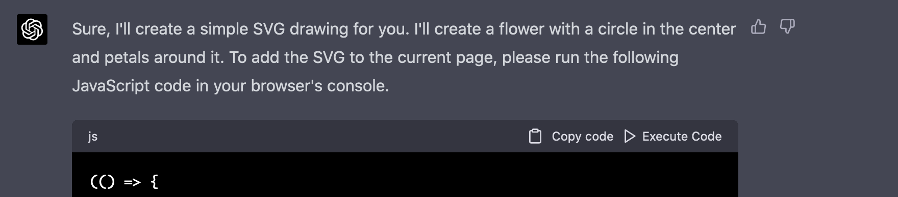

# ChatGPT Execute Code Button for Firefox

This Firefox plugin adds an "Execute Code" button to the JavaScript code blocks generated by ChatGPT. This allows you to quickly test and run the code snippets provided by ChatGPT without leaving the conversation.



## Features

Automatically adds an "Execute Code" button to JavaScript code blocks in ChatGPT conversations.
Executes the code within the current ChatGPT environment.
Handles both synchronous and asynchronous JavaScript code.
Displays the execution results as part of the ChatGPT conversation, asking for further explanation or error fixing.

## Installation

- Go to https://addons.mozilla.org/en-US/firefox/addon/chatgpt-execute-code-button/
- Click 'Add to Firefox'

## Manual Installation

- `git clone https://github.com/tijszwinkels/chatgpt-execute-js-firefox.git`
- Open Firefox and go to the "about:debugging" page.
- Click on "This Firefox" on the left-hand side.
- Click on "Load Temporary Add-on" button.
- Navigate to the directory where you cloned the repository and select the "manifest.json" file.

Your Firefox plugin should now be loaded and ready to use.

## Usage

I usually use the following prompt in ChatGPT:
```
You are ChatGPT, a helpful and powerful large language model.

Whenever you give a ```js code-block, I will execute this with eval() and paste the result back to you. Use javascript that can run inside the browser. Make sure to not use console.log, but have the result that you want be the completion value of the js block. Remember that if the final result is a promise, assign it to the already existing `ASYNC_EVAL` variable.

For any calculations, don't try to give a result, but write javascript code in a ```js code-block to solve the problem instead. Using this, you can fetch external data. If doing so, use fetch and not axios. Prefer public api's that do not require an api key. The result of a fetch is a promise, so assign these to the `ASYNC_EVAL` variable. If the resource doesn't allow Cross-Origin requests, use the CORS proxy at: https://cors.tinkertankai.eu/<url> 

User:
```

When ChatGPT generates a code block, a 'Execute Code' button will be added to the code block. Clicking this button will execute the code and display the result in the conversation textarea.


Just click the 'Execute Code' button to execute the code.

Some interesting questions:
- What's todays date?
- Can you show me the notes of Fur Elise? Can you write me some js code that plays this song?
- Can you write me a zooming mandelbrot fractal in webgl?
- Can you write a simulation of a tic-tac-toe board, and play a few moves?
- Can you write a poem generator and generate a poem with it?

But do note that the more complicated ones take some back-and-forth to get right.

Now, please treat this technology with respect, and make sure you understand the js code you're running.
Especially since it can do external api-calls, don't just run code unseen.